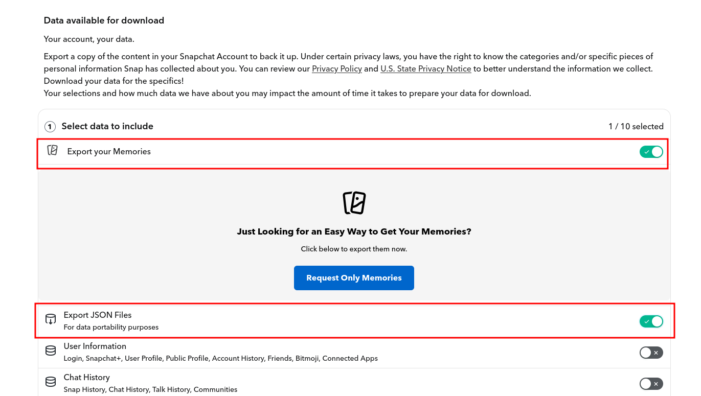
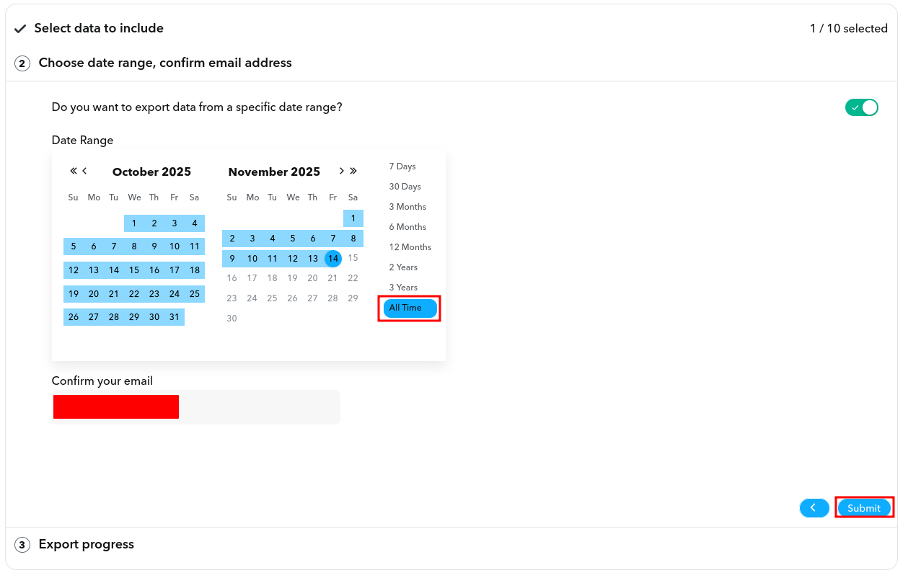

# Snapchat Memory Downloader

- [x] Download snapchat memories
- [x] Add date EXIF information
- [ ] Add geo tagging EXIF data

## Why?

Snapchat's memory export did not have date information on images. Exporting lots of memories was time-consuming and error-prone.

## Usage

```bash
snapchat-memory-downloader -f json/memories_history.json
```

This will download everything to the `./downloads` directory.

### Docker

```bash
sudo docker run --rm -v `pwd`:/workspace --user 1000  ghcr.io/defektive/snapchat-memory-downloader:latest
```

## Install

### Downloading

Download a binary from the [releases](https://github.com/defektive/snapchat-memory-downloader/releases) section.

### Building

```bash
go install github.com/defektive/snapchat-memory-downloader@latest
```

## How to request your data?

There are various app versions and settings layouts. Find the **My Data** area in your app or use the [web app](https://accounts.snapchat.com/v2/download-my-data).


- Select "**Export your Memories**".
- Select "**Export JSON Files**".



- Set the "**Date Range**" to "**All Time**"
- Confirm your email
- Click "**Submit**"
- Wait...


